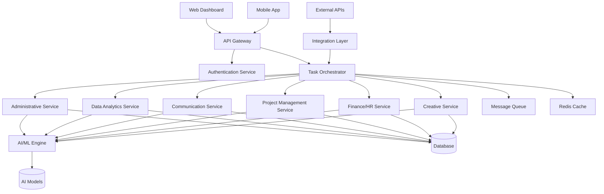

# Design Document

## Overview

The Business Task Automation System is designed as a microservices-based platform that leverages AI/ML capabilities to automate various business processes. The system follows a modular architecture where each business domain (Administrative, Data Analytics, Communication, etc.) is implemented as a separate service, allowing for independent scaling and development.

The platform uses an event-driven architecture with a central orchestration layer that coordinates tasks across different services. This design ensures loose coupling between components while maintaining system coherence and enabling complex workflow automation.

## Architecture

### High-Level Architecture



### Core Components

1. **API Gateway**: Single entry point for all client requests, handles routing, rate limiting, and authentication
2. **Task Orchestrator**: Central coordination service that manages workflows and task distribution
3. **Domain Services**: Specialized services for each business area (Admin, Data, Communication, etc.)
4. **AI/ML Engine**: Centralized AI processing service with model management and inference capabilities
5. **Integration Layer**: Handles connections to external systems (email, calendars, CRMs, etc.)
6. **Message Queue**: Asynchronous task processing and inter-service communication
7. **Shared Database**: Centralized data storage with service-specific schemas

## Components and Interfaces

### 1. API Gateway
- **Technology**: Kong or AWS API Gateway
- **Responsibilities**: Request routing, authentication, rate limiting, API versioning
- **Interfaces**: 
  - REST APIs for synchronous operations
  - WebSocket connections for real-time updates
  - GraphQL endpoint for complex queries

### 2. Task Orchestrator
- **Technology**: Node.js with Express or Python with FastAPI
- **Responsibilities**: Workflow management, task scheduling, service coordination
- **Key Classes**:
  - `WorkflowEngine`: Manages complex multi-step processes
  - `TaskScheduler`: Handles task queuing and priority management
  - `ServiceRegistry`: Maintains service discovery and health monitoring

### 3. Administrative Service
- **Technology**: Python with FastAPI
- **Responsibilities**: Email processing, calendar management, document generation
- **Key Classes**:
  - `EmailProcessor`: Handles email sorting, prioritization, and response generation
  - `CalendarManager`: Manages scheduling conflicts and meeting coordination
  - `DocumentGenerator`: Creates various document types from templates

### 4. Data Analytics Service
- **Technology**: Python with pandas, scikit-learn, Apache Spark for large datasets
- **Responsibilities**: Data cleaning, report generation, trend analysis
- **Key Classes**:
  - `DataCleaner`: Handles data preprocessing and quality checks
  - `ReportGenerator`: Creates automated reports and dashboards
  - `TrendAnalyzer`: Performs statistical analysis and pattern recognition

### 5. Communication Service
- **Technology**: Node.js with natural language processing libraries
- **Responsibilities**: Chatbot functionality, transcription, translation
- **Key Classes**:
  - `ChatbotEngine`: Handles conversational AI and FAQ responses
  - `TranscriptionService`: Converts audio to text with speaker identification
  - `TranslationService`: Provides multilingual support

### 6. AI/ML Engine
- **Technology**: Python with TensorFlow/PyTorch, MLflow for model management
- **Responsibilities**: Model serving, inference, continuous learning
- **Key Classes**:
  - `ModelManager`: Handles model deployment and versioning
  - `InferenceEngine`: Provides AI predictions and classifications
  - `TrainingPipeline`: Manages model retraining and improvement

## Data Models

### Core Entities

```typescript
interface User {
  id: string;
  email: string;
  role: UserRole;
  permissions: Permission[];
  preferences: UserPreferences;
  createdAt: Date;
  updatedAt: Date;
}

interface Task {
  id: string;
  type: TaskType;
  status: TaskStatus;
  priority: Priority;
  assignedTo: string;
  createdBy: string;
  data: TaskData;
  workflow: WorkflowStep[];
  createdAt: Date;
  completedAt?: Date;
}

interface WorkflowTemplate {
  id: string;
  name: string;
  description: string;
  steps: WorkflowStep[];
  triggers: TriggerCondition[];
  isActive: boolean;
}

interface Document {
  id: string;
  type: DocumentType;
  title: string;
  content: string;
  metadata: DocumentMetadata;
  tags: string[];
  createdBy: string;
  createdAt: Date;
}

interface Integration {
  id: string;
  service: ExternalService;
  credentials: EncryptedCredentials;
  configuration: IntegrationConfig;
  isActive: boolean;
  lastSync: Date;
}
```

### Domain-Specific Models

```typescript
// Administrative Domain
interface EmailMessage {
  id: string;
  from: string;
  to: string[];
  subject: string;
  body: string;
  priority: Priority;
  category: EmailCategory;
  sentiment: SentimentScore;
  actionItems: string[];
}

interface CalendarEvent {
  id: string;
  title: string;
  startTime: Date;
  endTime: Date;
  attendees: string[];
  location: string;
  conflictsWith: string[];
}

// Data Analytics Domain
interface Dataset {
  id: string;
  name: string;
  source: DataSource;
  schema: DataSchema;
  qualityScore: number;
  lastCleaned: Date;
}

interface Report {
  id: string;
  type: ReportType;
  parameters: ReportParameters;
  data: ReportData;
  generatedAt: Date;
  schedule: ReportSchedule;
}
```

## Error Handling

### Error Classification
1. **System Errors**: Infrastructure failures, service unavailability
2. **Business Logic Errors**: Validation failures, workflow violations
3. **Integration Errors**: External API failures, authentication issues
4. **AI/ML Errors**: Model inference failures, data quality issues

### Error Handling Strategy
- **Circuit Breaker Pattern**: Prevent cascading failures in service calls
- **Retry Logic**: Exponential backoff for transient failures
- **Graceful Degradation**: Fallback to manual processes when automation fails
- **Error Monitoring**: Comprehensive logging and alerting system

### Error Response Format
```typescript
interface ErrorResponse {
  error: {
    code: string;
    message: string;
    details?: any;
    timestamp: Date;
    requestId: string;
  };
  recovery?: {
    suggestions: string[];
    manualSteps?: string[];
  };
}
```

## Testing Strategy

### Unit Testing
- **Coverage Target**: 90% code coverage for all services
- **Framework**: Jest for Node.js services, pytest for Python services
- **Mock Strategy**: Mock external dependencies and AI model calls
- **Test Data**: Use synthetic data that mirrors production patterns

### Integration Testing
- **API Testing**: Automated testing of all REST endpoints
- **Workflow Testing**: End-to-end testing of complex business processes
- **Database Testing**: Test data consistency and transaction handling
- **External Integration Testing**: Mock external services for reliable testing

### Performance Testing
- **Load Testing**: Simulate concurrent users and high task volumes
- **Stress Testing**: Test system behavior under extreme conditions
- **AI Model Testing**: Validate model accuracy and response times
- **Database Performance**: Test query optimization and indexing

### Security Testing
- **Authentication Testing**: Verify access controls and token management
- **Authorization Testing**: Test role-based permissions
- **Data Encryption Testing**: Verify encryption in transit and at rest
- **Vulnerability Scanning**: Regular security assessments

### Monitoring and Observability
- **Application Metrics**: Response times, error rates, throughput
- **Business Metrics**: Task completion rates, user satisfaction scores
- **Infrastructure Metrics**: CPU, memory, disk usage
- **AI Model Metrics**: Accuracy, drift detection, inference latency

### Deployment Strategy
- **Containerization**: Docker containers for all services
- **Orchestration**: Kubernetes for container management
- **CI/CD Pipeline**: Automated testing and deployment
- **Blue-Green Deployment**: Zero-downtime deployments
- **Feature Flags**: Gradual rollout of new features