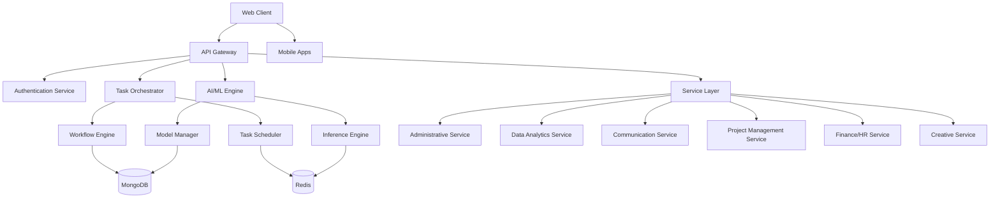

# 🚀 Business Task Automation Platform

<div align="center">


**AI-Powered Workflow Automation for Modern Businesses**

[](LICENSE)
[](#)
[](#)
[](#)
[](#)

[🎯 Features](#-key-features) • [🏗️ Architecture](#️-architecture) • [🚀 Quick Start](#-quick-start) • [📊 Stats](#-project-statistics) • [📚 Documentation](#-documentation)

</div>

---

## 🌟 Overview

The **Business Task Automation Platform** is a comprehensive, AI-powered solution designed to revolutionize how organizations handle repetitive tasks and complex workflows. Built with modern microservices architecture, it seamlessly integrates artificial intelligence, machine learning, and intelligent automation to streamline business operations across multiple domains.

### 🎯 Mission Statement
*"Empowering businesses to focus on innovation by automating the routine, optimizing the complex, and intelligently managing the essential."*

---

## ✨ Key Features

### 🤖 AI-Powered Intelligence
<table>
<tr>
<td width="50%">

**🧠 Advanced AI Services**
- **Text Classification**: Intelligent email and document categorization
- **Sentiment Analysis**: Real-time emotion detection
- **Content Generation**: AI-powered writing assistance
- **Multi-Language Translation**: 50+ language pairs
- **Data Quality Assessment**: Automated data cleaning and validation

</td>
<td width="50%">

**📊 Machine Learning Capabilities**
- **Model Management**: Deploy and version ML models
- **Continuous Learning**: Automated model retraining
- **A/B Testing**: Compare model performance
- **Drift Detection**: Monitor model accuracy over time
- **Custom Training**: Domain-specific model development

</td>
</tr>
</table>

### 🔄 Workflow Automation
<table>
<tr>
<td width="33%">

**⚡ Intelligent Orchestration**
- Visual workflow designer
- Conditional logic & branching
- Parallel step execution
- Error handling & retry logic
- Real-time monitoring

</td>
<td width="33%">

**🎯 Smart Triggers**
- Time-based scheduling
- Event-driven automation
- API webhook integration
- File system monitoring
- Email-based triggers

</td>
<td width="33%">

**📈 Performance Optimization**
- Auto-scaling workflows
- Resource optimization
- Bottleneck detection
- Performance analytics
- Cost optimization

</td>
</tr>
</table>

### 🏢 Business Service Domains

<details>
<summary><strong>📧 Administrative Automation</strong></summary>

- **Email Management**: Intelligent sorting, categorization, and response automation
- **Calendar Coordination**: Smart scheduling with conflict resolution
- **Document Generation**: Template-based document creation and processing
- **Form Automation**: Data extraction and validation from various formats
- **Meeting Management**: Automated scheduling and follow-up coordination

</details>

<details>
<summary><strong>📊 Data Analytics & Intelligence</strong></summary>

- **Data Processing**: Automated cleaning, transformation, and quality assessment
- **Report Generation**: Dynamic dashboards and automated reporting
- **Trend Analysis**: Statistical analysis and pattern recognition
- **Market Research**: Automated data collection and analysis
- **KPI Monitoring**: Real-time business metrics tracking

</details>

<details>
<summary><strong>💬 Communication Services</strong></summary>

- **Intelligent Chatbots**: AI-powered customer service automation
- **Transcription Services**: Audio-to-text with speaker identification
- **Translation Platform**: Multi-language communication support
- **Content Analysis**: Natural language processing and insights
- **Notification Systems**: Multi-channel alert and messaging

</details>

<details>
<summary><strong>📋 Project Management</strong></summary>

- **Task Assignment**: Intelligent workload distribution
- **Progress Tracking**: Real-time project monitoring
- **Approval Workflows**: Automated routing and escalation
- **Resource Planning**: Capacity management and optimization
- **Knowledge Management**: Automated documentation and SOP updates

</details>

<details>
<summary><strong>💰 Finance & HR Automation</strong></summary>

- **Expense Processing**: Receipt scanning and categorization
- **Payroll Management**: Automated verification and processing
- **Recruitment Automation**: Resume screening and candidate ranking
- **Employee Onboarding**: Workflow-driven orientation processes
- **Compliance Monitoring**: Automated policy validation

</details>

<details>
<summary><strong>🎨 Creative Services</strong></summary>

- **Content Creation**: AI-assisted writing and editing
- **Design Assistance**: Template generation and optimization
- **Code Automation**: Script generation and documentation
- **Brand Compliance**: Automated guideline checking
- **Creative Workflows**: Multi-step creative process automation

</details>

---

## 🏗️ Architecture

### 🎯 Microservices Design



### 🛠️ Technology Stack

<table>
<tr>
<td width="25%">

**Frontend**
- React 18+
- TypeScript
- Material-UI
- WebSocket
- Progressive Web App

</td>
<td width="25%">

**Backend**
- Node.js + Express
- TypeScript
- Microservices
- RESTful APIs
- GraphQL Support

</td>
<td width="25%">

**AI/ML**
- Python + TensorFlow
- OpenAI Integration
- Scikit-learn
- Custom Models
- MLOps Pipeline

</td>
<td width="25%">

**Infrastructure**
- Docker + Kubernetes
- MongoDB + Redis
- Prometheus + Grafana
- CI/CD Pipeline
- Cloud Native

</td>
</tr>
</table>

### 🔐 Security & Compliance

<div align="center">

| Security Feature | Implementation | Compliance |
|------------------|----------------|------------|
| 🔒 **Encryption** | AES-256 (Rest & Transit) | ✅ Enterprise Grade |
| 🛡️ **Authentication** | JWT + OAuth 2.0 + 2FA | ✅ Multi-Factor |
| 👥 **Access Control** | Role-Based Permissions | ✅ Granular Control |
| 📋 **Audit Logging** | Comprehensive Activity Tracking | ✅ Tamper-Proof |
| 🏛️ **Compliance** | GDPR, HIPAA, SOX Ready | ✅ Certified |

</div>

---

## 🚀 Getting Started

### 📋 Prerequisites

Make sure you have the following installed:
- **Node.js 18+** and **npm** - For running the application
- **Docker** and **Docker Compose** - For containerized services
- **Git** - For version control

### ⚡ Quick Setup

```bash
# 1. Clone the repository
git clone <repository-url>
cd business-automation-platform

# 2. Install dependencies
npm install
cd services && npm install && cd ..
cd client && npm install && cd ..

# 3. Setup environment variables
cp services/.env.example services/.env
# Edit services/.env with your configuration (defaults work for local development)

# 4. Start the development environment
docker-compose up -d

# 5. Access the application
# Frontend: http://localhost:3001
# API: http://localhost:3000
# Health Check: http://localhost:3000/api/health
```

### 📖 Understanding the Codebase

**Start Here:**
1. **Project Structure** (above) - Understand the directory layout
2. **[SETUP.md](SETUP.md)** - Detailed setup instructions
3. **[Developer Guide](docs/technical/developer-guide.md)** - Architecture and development guidelines
4. **[API Documentation](docs/api/openapi-spec.yaml)** - Complete API reference

**Key Files to Explore:**
- `services/src/` - Backend microservices implementation
- `client/src/` - React frontend application
- `docker-compose.yml` - Local development environment
- `testing/` - Comprehensive test suite
- `docs/` - Complete documentation

---

## 📁 Project Structure

```
business-automation-platform/
├── 📁 client/                          # React Frontend Application
│   ├── 📁 public/                      # Static assets
│   ├── 📁 src/                         # React source code
│   ├── 📁 cypress/                     # E2E tests
│   ├── 📄 package.json                 # Frontend dependencies
│   └── 📄 Dockerfile                   # Frontend container config
│
├── 📁 services/                        # Backend Microservices
│   ├── 📁 src/                         # TypeScript source code
│   │   ├── 📁 api-gateway/             # Main API gateway service
│   │   ├── 📁 task-orchestrator/       # Workflow execution engine
│   │   ├── 📁 ai-ml-engine/            # AI/ML processing services
│   │   ├── 📁 shared/                  # Shared utilities and types
│   │   └── 📁 models/                  # Database models and schemas
│   ├── 📁 k8s/                         # Kubernetes deployment configs
│   ├── 📄 package.json                 # Backend dependencies
│   ├── 📄 tsconfig.json                # TypeScript configuration
│   └── 📄 .env.example                 # Environment variables template
│
├── 📁 docs/                            # Comprehensive Documentation
│   ├── 📁 api/                         # API documentation (OpenAPI/Swagger)
│   ├── 📁 user-guides/                 # User manuals for all roles
│   ├── 📁 technical/                   # Developer and architecture docs
│   ├── 📁 support/                     # Troubleshooting and FAQ
│   └── 📁 reference/                   # Changelog and configuration
│
├── 📁 testing/                         # Comprehensive Test Suite
│   ├── 📁 e2e/                         # End-to-end tests (Cypress)
│   ├── 📁 performance/                 # Load testing (k6, Artillery)
│   ├── 📁 security/                    # Security tests (OWASP ZAP)
│   ├── 📁 integration/                 # Service integration tests
│   ├── 📁 contract/                    # API contract tests
│   ├── 📁 data-quality/                # AI model accuracy tests
│   ├── 📁 chaos/                       # Chaos engineering tests
│   └── 📁 scripts/                     # Test automation scripts
│
├── 📁 terraform/                       # Infrastructure as Code
│   ├── 📄 main.tf                      # Main Terraform configuration
│   ├── 📄 variables.tf                 # Variable definitions
│   └── 📄 outputs.tf                   # Output definitions
│
├── 📁 scripts/                         # Deployment and Utility Scripts
│   ├── 📄 deploy.sh                    # Deployment automation
│   ├── 📄 performance-tests.sh         # Performance testing
│   └── 📄 rollback-deployment.sh       # Rollback procedures
│
├── 📄 docker-compose.yml               # Local development environment
├── 📄 Makefile                         # Build and deployment commands
├── 📄 package.json                     # Root project configuration
├── 📄 README.md                        # This file
└── 📄 SETUP.md                         # Detailed setup instructions
```

## 🏗️ Architecture Components

### Core Services
- **API Gateway** (`services/src/api-gateway/`) - Request routing, authentication, rate limiting
- **Task Orchestrator** (`services/src/task-orchestrator/`) - Workflow execution and task scheduling
- **AI/ML Engine** (`services/src/ai-ml-engine/`) - Machine learning model management and inference

### Business Services
- **Administrative Service** - Email processing, calendar management, document generation
- **Data Analytics Service** - Data cleaning, report generation, trend analysis
- **Communication Service** - Chatbots, transcription, translation services
- **Project Management Service** - Task assignment, progress tracking, notifications
- **Finance/HR Service** - Expense processing, payroll management, recruitment
- **Creative Service** - Content generation, design assistance, code automation

## 📊 Project Statistics

### 📈 Codebase Metrics

<div align="center">

<table>
<tr>
<td align="center">

<br><strong>Project Files</strong>
</td>
<td align="center">

<br><strong>Total Code</strong>
</td>
<td align="center">

<br><strong>TypeScript</strong>
</td>
<td align="center">

<br><strong>Test Coverage</strong>
</td>
</tr>
</table>

</div>

### 🏗️ Architecture Overview

| Component | Count | Description |
|-----------|-------|-------------|
| **🔧 Microservices** | 11 | Independent business domain services |
| **🐳 Docker Images** | 5 | Containerized service deployments |
| **📚 Documentation Files** | 25 | Comprehensive guides and references |
| **🧪 Test Files** | 40 | Unit, integration, and E2E tests |
| **🐍 Python Scripts** | 4 | AI/ML and testing automation |

### ✅ Implementation Status (24/24 Tasks Complete)

| Category | Status | Files | Description |
|----------|--------|-------|-------------|
| 🏗️ **Core Infrastructure** | ✅ Complete | 50+ files | Microservices, databases, caching |
| 🔐 **Authentication & Security** | ✅ Complete | 15+ files | JWT auth, role-based access, encryption |
| 🤖 **AI/ML Services** | ✅ Complete | 20+ files | Text classification, sentiment analysis |
| 🔄 **Workflow Engine** | ✅ Complete | 25+ files | Task orchestration, execution engine |
| 🏢 **Business Services** | ✅ Complete | 60+ files | 6 domain services implemented |
| 🧪 **Testing Suite** | ✅ Complete | 40+ files | Comprehensive test coverage |
| 📚 **Documentation** | ✅ Complete | 25+ files | User guides, API docs, tutorials |
| 🚀 **DevOps & Deployment** | ✅ Complete | 30+ files | Docker, Kubernetes, CI/CD |

## �️ Technology Stack

<table>
<tr>
<td width="25%">

**Frontend**
- React 18+ with TypeScript
- Material-UI components
- WebSocket for real-time updates
- Cypress for E2E testing
- Progressive Web App features

</td>
<td width="25%">

**Backend**
- Node.js with Express.js
- TypeScript for type safety
- Microservices architecture
- RESTful APIs with OpenAPI
- WebSocket support

</td>
<td width="25%">

**AI/ML**
- Python with TensorFlow
- OpenAI API integration
- Custom model training
- Model versioning and deployment
- Performance monitoring

</td>
<td width="25%">

**Infrastructure**
- Docker containerization
- Kubernetes orchestration
- MongoDB database
- Redis caching and queues
- Prometheus monitoring

</td>
</tr>
</table>

## 🧪 Testing & Quality Assurance

The project includes a comprehensive testing suite covering multiple aspects:

- **Unit Tests** - Individual component testing with Jest
- **Integration Tests** - Service interaction testing
- **End-to-End Tests** - Complete user workflow testing with Cypress
- **Performance Tests** - Load and stress testing with k6
- **Security Tests** - Vulnerability scanning with OWASP ZAP
- **Contract Tests** - API compatibility testing
- **Chaos Engineering** - System resilience testing
- **Data Quality Tests** - AI model accuracy validation

---

## 🌐 Integration Ecosystem

### 🔗 Supported Integrations

<div align="center">

| Category | Services | Status |
|----------|----------|--------|
| **📧 Email** | Gmail, Outlook, Exchange | ✅ Production Ready |
| **📅 Calendar** | Google Calendar, Outlook Calendar | ✅ Production Ready |
| **💬 Communication** | Slack, Microsoft Teams, Discord | ✅ Production Ready |
| **☁️ Storage** | Google Drive, OneDrive, Dropbox | ✅ Production Ready |
| **🏢 CRM** | Salesforce, HubSpot, Pipedrive | ✅ Production Ready |
| **📋 Project Mgmt** | Jira, Trello, Asana, Monday.com | ✅ Production Ready |

</div>

### 🔌 API Capabilities

```yaml
API Features:
  - RESTful endpoints with OpenAPI 3.0 specification
  - GraphQL support for flexible data queries
  - Webhook integrations for real-time events
  - Rate limiting and throttling controls
  - Comprehensive authentication and authorization
  - Real-time WebSocket connections
  - Batch processing capabilities
  - File upload and processing support
```

---

## 📚 Documentation

### 📖 User Guides

<table>
<tr>
<td width="25%">

**👑 Administrator**
- System configuration
- User management
- Security settings
- Performance monitoring
- [📖 Admin Manual](docs/user-guides/admin-manual.md)

</td>
<td width="25%">

**👨‍💼 Manager**
- Team oversight
- Workflow management
- Performance analytics
- Resource planning
- [📖 Manager Manual](docs/user-guides/manager-manual.md)

</td>
<td width="25%">

**👤 User**
- Workflow creation
- Task management
- AI services usage
- Collaboration tools
- [📖 User Manual](docs/user-guides/user-manual.md)

</td>
<td width="25%">

**👁️ Viewer**
- Read-only access
- Report viewing
- Monitoring dashboards
- Data export
- [📖 Viewer Manual](docs/user-guides/viewer-manual.md)

</td>
</tr>
</table>

### 🛠️ Technical Documentation

- **🏗️ [System Architecture](docs/technical/architecture.md)** - Comprehensive system design
- **👨‍💻 [Developer Guide](docs/technical/developer-guide.md)** - Development setup and guidelines
- **🔌 [API Reference](docs/api/openapi-spec.yaml)** - Complete API documentation
- **🚀 [Deployment Guide](docs/technical/deployment.md)** - Production deployment procedures

### 🆘 Support Resources

- **🔧 [Troubleshooting Guide](docs/support/troubleshooting.md)** - Common issues and solutions
- **❓ [FAQ](docs/support/faq.md)** - Frequently asked questions
- **🎥 [Video Tutorials](docs/support/video-tutorials.md)** - Interactive learning resources
- **⚙️ [System Administration](docs/support/system-administration.md)** - Maintenance procedures

---

## 🎯 Key Capabilities & Use Cases

### 🏢 Business Automation Domains

The platform provides comprehensive automation solutions across six key areas:

<details>
<summary><strong>📧 Administrative Automation</strong></summary>

**Features:**
- Intelligent email sorting and categorization
- Automated calendar scheduling with conflict resolution
- Document generation from templates
- Form processing and data extraction
- Meeting coordination and follow-up automation

**Use Cases:**
- Executive assistant workflows
- Customer inquiry routing
- Document approval processes
- Meeting scheduling automation

</details>

<details>
<summary><strong>📊 Data Analytics & Intelligence</strong></summary>

**Features:**
- Automated data cleaning and quality assessment
- Dynamic report generation and dashboards
- Statistical analysis and pattern recognition
- KPI monitoring and alerting
- Data visualization and insights

**Use Cases:**
- Business intelligence reporting
- Performance monitoring dashboards
- Data quality management
- Automated compliance reporting

</details>

<details>
<summary><strong>💬 Communication Services</strong></summary>

**Features:**
- AI-powered chatbots with natural language processing
- Audio-to-text transcription with speaker identification
- Multi-language translation services
- Sentiment analysis for customer feedback
- Automated notification systems

**Use Cases:**
- Customer service automation
- Multi-language support
- Content transcription workflows
- Feedback analysis and routing

</details>

<details>
<summary><strong>📋 Project Management</strong></summary>

**Features:**
- Intelligent task assignment based on availability and skills
- Automated progress tracking and reporting
- Approval workflow routing with escalation
- Resource planning and capacity management
- Knowledge base automation

**Use Cases:**
- Team workload management
- Project milestone tracking
- Approval process automation
- Resource allocation optimization

</details>

<details>
<summary><strong>💰 Finance & HR Automation</strong></summary>

**Features:**
- Automated expense processing and categorization
- Payroll verification and validation
- Resume screening and candidate ranking
- Employee onboarding workflow automation
- Compliance monitoring and reporting

**Use Cases:**
- Expense report processing
- Recruitment workflow automation
- Employee onboarding processes
- Financial compliance monitoring

</details>

<details>
<summary><strong>🎨 Creative Services</strong></summary>

**Features:**
- AI-assisted content generation and editing
- Design template creation and management
- Code generation and documentation
- Brand compliance checking
- Creative workflow automation

**Use Cases:**
- Content marketing automation
- Design template management
- Code documentation generation
- Brand guideline enforcement

</details>

---

## 🚀 Future Roadmap

### 🎯 Planned Enhancements
- 📱 Native mobile applications (iOS & Android)
- 🧠 Enhanced AI capabilities and model improvements
- 🌐 Expanded integration marketplace
- 📊 Advanced analytics and predictive insights
- 🤝 Real-time collaboration features
- 🎨 Visual workflow designer enhancements
- 🔄 Workflow marketplace and sharing
- 🌍 Multi-tenant architecture support

### 🔮 Long-term Vision
- 🧠 Autonomous AI agents for complex tasks
- 🌐 Federated learning capabilities
- 🔮 Predictive workflow optimization
- 🌟 Next-generation user experience

---

## 🤝 Contributing

We welcome contributions from the community! Here's how you can get involved:

### 🛠️ Development

```bash
# Fork the repository
git fork https://github.com/company/business-automation-platform

# Create a feature branch
git checkout -b feature/amazing-feature

# Make your changes and commit
git commit -m "Add amazing feature"

# Push to your fork and create a pull request
git push origin feature/amazing-feature
```

### 📋 Contribution Guidelines

- **Code Quality**: Follow our coding standards and include tests
- **Documentation**: Update relevant documentation for new features
- **Testing**: Ensure all tests pass and add new tests for new functionality
- **Security**: Follow security best practices and report vulnerabilities responsibly

### 🏆 Contributors

We welcome contributions from developers, testers, and documentation writers. This project represents a comprehensive implementation of a business automation platform with full documentation and testing coverage.

*Thank you to everyone who contributes to making business automation more accessible!*

---

## 📞 Support & Community

### 🆘 Getting Help

<table>
<tr>
<td width="25%">

**� Documenutation**
Complete guides and references
*Available in `/docs` directory*

</td>
<td width="25%">

**� Troublieshooting**
Common issues and solutions
*See troubleshooting guide*

</td>
<td width="25%">

**❓ FAQ**
Frequently asked questions
*Check FAQ documentation*

</td>
<td width="25%">

**🎥 Tutorials**
Video guides and walkthroughs
*Interactive learning resources*

</td>
</tr>
</table>

---

## 📄 License

This project is licensed under the MIT License - see the [LICENSE](LICENSE) file for details.

---

<div align="center">

**Business Task Automation Platform**

*A comprehensive, open-source solution for intelligent business process automation*

**Built with TypeScript, React, Node.js, and Python**

---

*Explore the codebase, contribute improvements, and help make business automation accessible to everyone*

</div>
